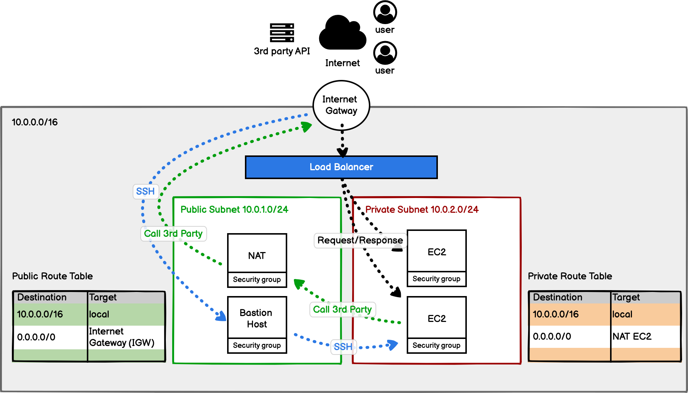
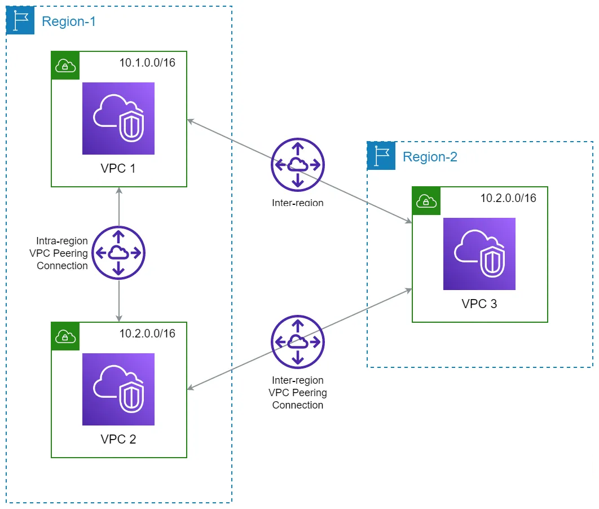
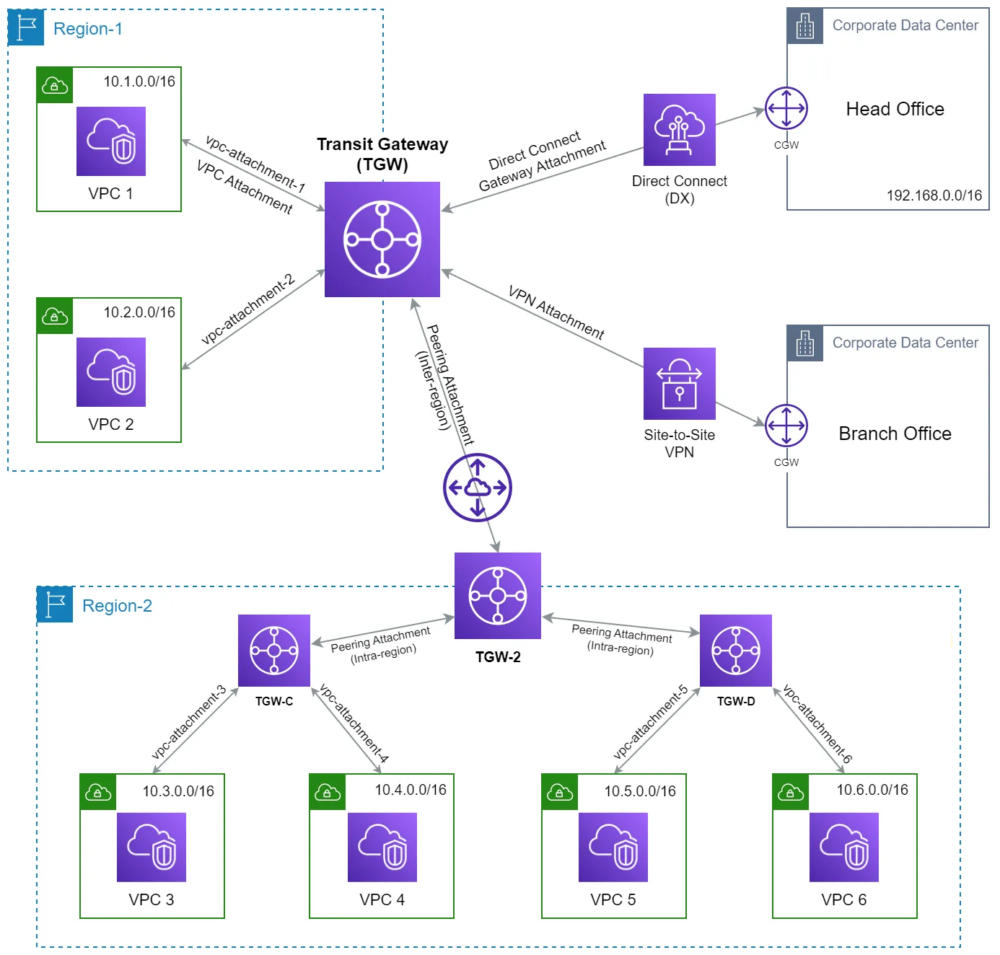
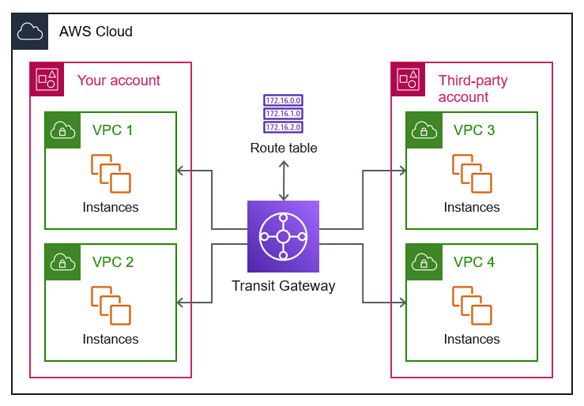
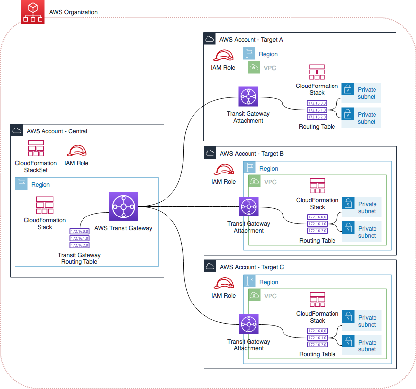
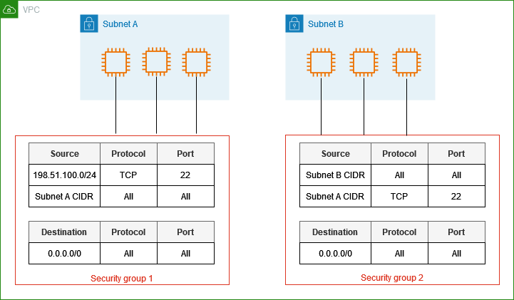

# AWS Networking Fundamentals



## 1 VPC Overview

* Your private section of AWS cloud
* Complete control over virtual network
* Similar to traditional network in the data center

## 2 CIDR (IP Address range)

* **Classless Inter-Domain Routing** (CIDR)
  
  RFC 1918 Size
  
  * Large: 10.0.0.0/8
  * Medium: 172.16.0.0/12
    * 10.0.0.0/16 (65K IPs) for medium-sized VPC
      * 172.31.0.0/16 alternative
  * Small: 192.168.0.0/16
    * 192.168.1.0/24 for smaller size VPC

* AWS Reserved IPs:
  
  * First 4 and last IPs

### 2.1 Sizing Guidelines

#### Small Deployments

* Up to 250 instances: Use /24 per subnet
* Example:
  * 10.0.1.0/24 (public)
  * 10.0.2.0/24 (private)

#### Medium Deployments

* Up to 1000 instances: Use /22 per subnet (32 bits, 32-22 {POW(2,32-22)  -1}
* Example:
  * 10.0.0.0/22 (public),
  * 10.0.4.0/22 (private)

#### Large Deployments

* 1000+ instances: Use /20 or larger
* Example:
  * 10.0.0.0/20 (public),
  * 10.0.16.0/20 (private)

### 2.2 Multi-VPC Design Considerations

#### VPC Peering



* Use different second octets for each VPC
* Example:
  * VPC 1: 10.1.0.0/16
  * VPC 2: 10.2.0.0/16
  * VPC 3: 10.3.0.0/16

#### Transit Gateway



- Transit Gateway is **automatically deployed across multiple Availability Zones**, ensuring fault tolerance.

- It uses a **managed, highly available infrastructure** with distributed control and data planes for redundancy.

- **Dynamic route propagation** allows rerouting through alternative paths to maintain connectivity during issues.

- **Active-active architecture** with multiple endpoints across Availability Zones prevents single points of failure.
* Use different first octets if possible

* Example:
  
  * Dev VPCs: 10.0.0.0/8
  * Prod VPCs: 172.16.0.0/12
  * Shared Services: 192.168.0.0/16

### 2.3 Common Pitfalls to Avoid

#### Too Small CIDR Blocks

* Can't be expanded later
* Limits future growth
* Solution: Always plan for 2-3x current needs

#### Overlapping CIDR Blocks

* Prevents VPC peering
* Complicates network management
* Solution: Document all CIDR ranges in use

#### Irregular Subnet Sizes

* Complicates management
* Makes automation harder
* Solution: Use consistent subnet sizes

## 3 Subnets (Public vs Private)

### Public subnet

* Direct Internet Access
* Used for public-facing resources
* Examples
  * Web servers
  * Load balancers
  * Bastion hosts

### Private subnet

* No Direct Internet Access
* Used for internal resources
* Examples
  * Databases
  * Application servers
  * Internal services

## 4 Visualization Tool

* Resource Map (Networking component arrangements)
  * Free
* AWS Network Manager
  * Amazon VPC IPAM (IP Address Manager)
    * Manage CIDR address spaces including public and private IPs
    * Free and Advanced tier
  * Reachability Analyzer
    * Troubleshoot connectivity issues from source to destination resource
  * Network Access Analyzer
    * Identify unintended network access to resources
    * Helps to improve network security posture
  * Infrastructure Performance
    * Aggregate network latency between AWS regions and AZs
* [CIDR/Subnet Visual Tool](https://www.solarwinds.com/free-tools/advanced-subnet-calculator "CIDR/Subnet Visual Tool")

### Quiz

#### Network Design

- Why is it important to choose the correct CIDR block when creating a VPC?
  
  - IP planning
  
  - Avoid IP conflict

- How does subnetting impact the architecture of a VPC?
  
  - Enhances security of the instances/network elements
  
  - Avoid flat network (not segmenting)

- What are the advantages of using both public and private subnets in a VPC?
  
  - Enhance security
  
  - Isolate the internal service/servers/application

#### Connectivity

- What are the different ways to connect a VPC to the internet?
  
  - IGW, NAT, Bastion host

- How does VPC peering work, and when would you use it?
  
  - It allows to connect disparate VPCs (TBD)
  
  - VPC perring (mesh connectivity) or TGW (hub and spoke)

- When would you use a VPC endpoint instead of an Internet Gateway?
  
  - TBD

#### Cost Management

- How can you minimize costs associated with VPC data transfer? (TBD)

- What factors influence the cost of maintaining a VPC?
  
  - VPC peering - internal traffic (so no cost)
  
  - Data transfer (outgoing), VPN connectity (outbound data transfer)

## 5 Internet Gateway

* A horizontally scaled, redundant, and highly available VPC component
* Provides connectivity between VPC and the internet
* Performs NAT for instances with public IPv4 addresses

### 5.1 Key Components for Internet Access

1. **Internet Gateway**
   * Attached to VPC
   * Only one IGW per VPC
2. **Route Table**
   * Route to IGW (0.0.0.0/0 → IGW)
   * Associated with subnet
3. **Public IP**
   * Instance needs public IP
   * Can be Elastic IP or auto-assigned
4. **Security Group**
   * Allow necessary inbound/outbound traffic
5. **NACL**
   - Network rules for subnet

### 5.2 How IGW Works

1. **Incoming Traffic Flow**

```txt
Internet -> IGW -> Route Table -> Public Subnet(IP) -> EC2 Instance (security group)
```

1. **Outgoing Traffic Flow**

```txt
EC2 Instance (security group) -> Public Subnet(IP) -> Route Table -> IGW -> Internet
```

### 5.3 Common Use Cases

| **Public Web Services**                     | **Outbound Internet Access**                                   | **Hybrid Architectures**                                                      |
| ------------------------------------------- | -------------------------------------------------------------- | ----------------------------------------------------------------------------- |
| Web servers - Load balancers -Bastion hosts | \* Software updates\* API calls\* External service integration | \* VPN endpoints\* Direct Connect public VIF\* Third-party network appliances |

### Quiz

#### High Availability

- What happens to connectivity if an Internet Gateway is not set up properly?
  
  - No internet connection

- What configuration steps are important for maximizing availability with an Internet Gateway?
  
  - First is configuration of Route table for IGW 
  
  - Associate this routable with public subnet
  
  - Have multiple route tables associated with multi AZ to expose public subnets

#### Security

- How do you secure resources exposed through an Internet Gateway?
  
  - Security group and NACL 

- What are the potential security vulnerabilities of using an Internet Gateway?
  
  - unauthorized access

- How can you minimize risks when using an Internet Gateway?
  
  - Use private subnet to deploy sensitive resources
  
  - SG / NACL

#### Cost Optimization

- How does data transfer through an Internet Gateway affect costs?
  
  - Outbound traffic costs

- What measures can reduce internet data transfer costs?
  
  - VPC connectivity, VPC endpoints, colocate resources

#### Architecture

- What is the purpose of an Internet Gateway in a VPC architecture?
  
  - Internet access

- How do route tables impact the use of an Internet Gateway?
  
  - gate keeper to decide whether traffic allowed to go outside

- Why might you choose an Internet Gateway over a NAT Gateway for certain resources?
  
  - TBD

## 6 NAT Gateway

#### What is NAT Gateway? Network Address Translation (NAT) service

* Allows private subnet resources to access the internet
* Prevents inbound connections from the internet
* Managed service by AWS (high availability within AZ)

#### NAT Gateway vs NAT Instance

* AWS managed vs Self managed

#### Basic Architecture

```txt
Private Subnet -> Route Table -> NAT Gateway -> Internet Gateway -> Internet
```

### Quiz

#### High Availability

* What happens if a NAT Gateway is deployed in a single AZ and that AZ becomes unavailable?
* How does deploying a NAT Gateway in each AZ improve fault tolerance?
* What are the benefits of using different route tables for each AZ?

#### Bandwidth Planning

* Why is it important to estimate peak bandwidth requirements for a NAT Gateway?
* How can you use CloudWatch metrics to monitor NAT Gateway performance?
* What strategies can be used to handle unexpected bursts in traffic?
* How do bandwidth limitations impact NAT Gateway performance?

#### Cost Optimization

* What are the cost benefits of sharing a NAT Gateway across multiple subnets?
* How can VPC endpoints help reduce NAT Gateway costs?  (TBD)
* What should be monitored to effectively manage data transfer costs?
* When should you consider using AWS Direct Connect instead of a NAT Gateway to reduce costs? 

## 7 Route Tables

### 7.1 What is a Route Table?

- Virtual routing configuration for VPC traffic

- Determines how network traffic is directed

- Contains a set of rules (routes) for network communication

- Each subnet must be associated with exactly one route table

### 7.2 Route Types

```
Local Route:     (VPC CIDR) -> local
Internet Route:  0.0.0.0/0 -> igw-id
NAT Route:       0.0.0.0/0 -> nat-id
VPC Peer:        peer-CIDR -> pcx-id
Gateway:         CIDR -> tgw-id
Endpoint:        prefix -> vpce-id
```

### Quiz

#### Security

- How would you configure route tables to prevent unauthorized cross-VPC communication in a hub-and-spoke topology?

- Explain how route table misconfigurations can expose private subnets to the internet unintentionally. What steps can be taken to prevent this?

#### Connectivity

- What challenges arise when integrating multiple spoke VPCs through a Transit Gateway, each with different CIDR blocks that might overlap? How can route tables be configured to overcome this?

- Describe how route propagation impacts route table complexity in a scenario with multiple hub and spoke VPCs interconnected. How can you simplify the route table configuration?

## 8 Network Connectivity Patterns

### 8.1 Startup to Small organizations

**8.1.1 Public-Private Subnet**

- A VPC is configured with **public subnets** (accessible via the internet) and **private subnets** (no direct internet access).

- A **NAT Gateway** or **NAT instance** is used to provide outgoing internet access for resources in the private subnets.

- Why it works?
  
  - Simplicity
  
  - Cost-effective: single NAT gateway
  
  - Security: through private subnets

**8.1.2 VPC Peering**

- Two or more VPCs are directly connected through **VPC peering connections**.

- Why it works?
  
  - Direct connectivity: less overhead
  
  - Low cost: no TGW cost
  
  - Manageable: <5 VPCs

#### 8.2 Medium to Large organizations

**8.2.1 Hub-and-Spoke using Transit Gateway TGW**

- Uses TGW as a central hub that connects multiple VPCs

- Centralized routing for inter-VPC traffic

- [More reading](https://docs.aws.amazon.com/prescriptive-guidance/latest/integrate-third-party-services/architecture-3.html)

**VPC connectivity through TGW**



**TGW connectivity in multi account**



- Why it works?
  
  - Scalable connectivity: Direct connectivity may end up in mess
  
  - Centralized management: Central point for routing, security and compliance through shared services (firewalls, NATs)
  
  - Flexible: segregation of Dev, Test and Prod

## 9 Security Groups

* Instance level firewall
* Stateful packet filtering
* Allow rules only
* Best for application-level security



## 10 NACLs

* Subnet level firewall
* Stateless
* Allow and deny rules
* Best for network-level security


## 11 VPC Endpoints

- A virtual device enabling private connections to AWS services
- Eliminates need for Internet Gateway, NAT device, VPN, or Direct Connect
- Keeps traffic within AWS network
- Horizontal scaling and HA
- Two types: 
  - Interface Endpoints (AWS PrivateLink)
    - Creates an Elastic Network Interface (ENI) with private IP
    - Charged hourly and by data processed  
    - Uses DNS entries to route traffic
    - **Supported Services Include:**
      - Amazon API Gateway
      - AWS Systems Manager
      - Amazon CloudWatch
      - Amazon ECR
      - Amazon ECS
      - Many others

```
Private Subnet EC2 -> ENI -> AWS PrivateLink -> AWS Service
```

- Gateway Endpoints
  
  - Free to use
  
  - Only supports S3 and DynamoDB
  
  - Uses route tables for traffic routing
  
  - Highly available without bandwidth constraints

```
Private Subnet EC2 -> Route Table -> Gateway Endpoint -> AWS Service (S3/DynamoDB)
```

## Best Practices for Networking

1. **Security**
   * Only attach IGW to VPCs that need internet access
   * Use security groups and NACLs to control traffic
   * Monitor IGW traffic using VPC Flow Logs
2. **Architecture**
   * Use private subnets for internal resources
   * Implement NAT Gateway for private subnet internet access
   * Consider AWS PrivateLink for AWS services
3. **Cost Optimization**
   * Monitor data transfer costs
   * Use VPC endpoints where possible
   * Consider Direct Connect for heavy traffic

## 2. DNS and Domain Management

* Route 53 Overview
  * Highly available DNS service
  * Global service
  * Integrates with AWS services
  * Supports multiple routing policies
* DNS Record Types
  * A (Address) - IPv4
  * AAAA - IPv6
  * CNAME - Canonical name
  * MX - Mail exchange
  * TXT - Text
  * NS - Name server
  * SOA - Start of authority
* Routing Policies
  * Simple
  * Weighted
  * Latency-based
  * Geolocation
  * Failover
  * Multi-value answer
* Health Checks
* Domain Registration

## Hands-on Labs

### VPC Setup and Configuration

1. **Demo (15 mins)**
   
   * Create a VPC with public and private subnets
   * Configure Internet Gateway and NAT Gateway
   * Set up route tables
   * Deploy a test EC2 instance

2. **Guided Practice (30 mins)**
   
   * Follow along to create a multi-AZ VPC
   * Configure security groups
   * Set up VPC endpoints for S3
   * Test connectivity

3. **Independent Practice (45 mins)**
   
   . Design and implement a VPC for a three-tier application
   
   . Include both public and private subnets
   
   . Configure appropriate security groups
   
   . Document the implementation

# Miscellaneous

## 1. TCP/IP

**OSI Layers Overview**


**Details**
