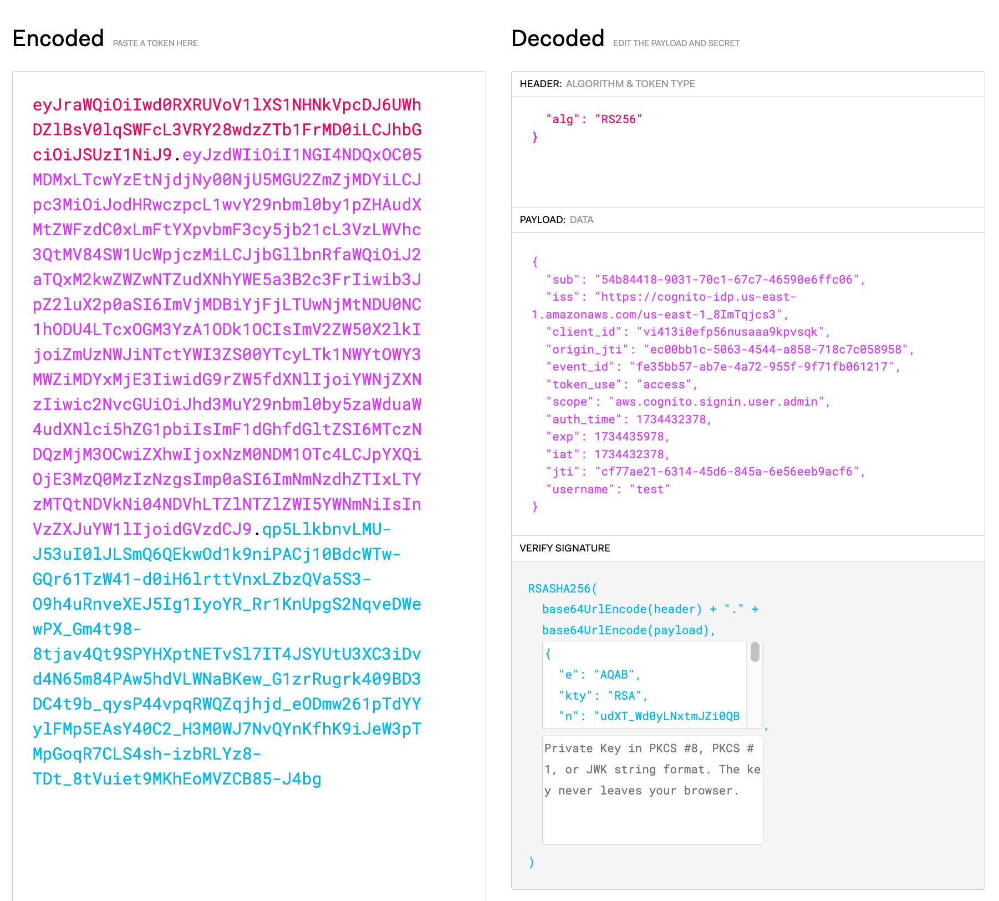

# OAuth 2.0 and OpenID Connect Fundamentals

## 1 Overview of OAuth 2.0 and OpenID Connect

* **OAuth 2.0** is an open standard for access delegation, commonly used to grant websites or applications limited access to user data without exposing credentials. -
  * No standard way of getting user information (who you are?)
  * Design for permissions/authorization - what scope
* **OpenID Connect (OIDC)** is an identity layer built on top of OAuth 2.0, providing authentication and additional user information.

Key Components:

- **Resource Owner** – User who authorizes access.
- **Client** – Application requesting access.
- **Authorization Server** – Issues access tokens.
- **Resource Server** – Hosts the protected resources.
- **Redirect URI** – URL to which the authorization server redirects the user after granting or denying permission.
- **Client ID** – Unique identifier assigned to the client application by the authorization server.
- **Client Secret** – Confidential key used by the client to authenticate with the authorization server.
- **Scope** – Specifies the level of access requested by the client.
- **Consent** – User approval for the requested scopes and permissions.
- **Access Token** – Token used to access protected resources.
- **Authorization Code** – Temporary code exchanged for an access token.


## 2 OAuth 2.0 Authorization Flows

### 2.1 Authorization Code Flow (Front channel & Back channel)


* **Process:**
1. **User Accesses Application:**
   
   - The user attempts to access the application.
   
   - The application redirects the user to the authorization server with a request containing the **Client ID**, **Redirect URI**, and requested **Scope**.

2. **Authorization Request:**
   
   - The authorization server validates the request and presents a login page to the user.

3. **User Authentication:**
   
   - The user enters their credentials (username and password) to authenticate.

4. **User Consent:**
   
   - After successful authentication, the user is prompted to consent to the requested scopes (e.g., access to profile, email).

5. **Authorization Code Issued:**
   
   - Upon consent, the authorization server generates an **Authorization Code** and redirects the user back to the application with the code.

6. **Code Exchange for Token:**
   
   - The application sends the authorization code, **Client ID**, **Client Secret**, and **Redirect URI** to the authorization server.

7. **Access Token Issued:**
   
   - If validated successfully, the authorization server issues an **Access Token** (and optionally a **Refresh Token**).

8. **Resource Access:**
   
   - The application uses the access token to request protected resources from the resource server.
* **Best for:** Web apps with server-side logic.

### 2.2 Implicit Flow (Front channel)


* **Process:**
  
  - 1. **User Accesses Application:**
       
       - The user attempts to access the application.
       
       - The application redirects the user to the authorization server with a request containing the **Client ID**, **Redirect URI**, and requested **Scope**.
    
    2. **Authorization Request:**
       
       - The authorization server validates the request and presents a login page to the user.
    
    3. **User Authentication:**
       
       - The user enters their credentials (username and password) to authenticate.
    
    4. **User Consent:**
       
       - After successful authentication, the user is prompted to consent to the requested scopes.
    
    5. **Token Issued Directly:**
       
       - Upon consent, the authorization server issues an **Access Token** directly to the client without generating an authorization code.
       
       - The access token is returned in the URL fragment, making it accessible to the client immediately.
    
    6. **Resource Access:**
       
       - The client uses the access token to request protected resources from the resource server.

* **Best for:** Single-page applications (SPA). Pure React/Angular app with backend API, but no page rendering engine in backend

### 2.3 Client Credentials Flow (Back channel)

* **Process:**
  1. Client directly requests tokens using its own credentials.
* **Best for:** Machine-to-machine (M2M) communication.

### 2.4 Resource Owner Password Credentials (ROPC) Flow (Back Channel)

* **Process:**
  1. User provides username/password directly to the client.
  2. Tokens are issued without redirect.
* **Best for:** Legacy applications.

### Pre-2014 Era of Identity Use cases (OAuth2.0)

- Simple login (*Authentication*)

- Single sign-on across sites (*Authentication*)

- Mobile app login (*Authentication*)

- Delegated authorization (**Authorization**)

Early Facebook/Google buttons before 2010

### Quiz: OAuth 2.0 Flows

1. Which OAuth 2.0 flow is most secure for web apps?
2. Why is the Implicit Flow less secure than the Authorization Code Flow?
3. In which scenario would you use the Client Credentials Flow?

---

## 3 OpenID Connect (OIDC) Basics


### 3.1 How OIDC Extends OAuth 2.0

* Provides identity verification in addition to OAuth 2.0's access delegation.
* Returns **ID Tokens** that contain user identity information.
* Supports Single Sign-On (SSO).
* Adds:
  * ID token
  * Userinfo endpoint
  * Standard set of scopes
  * Standard implemenation

### 3.2 ID Token Structure

* **Header** – Token type and algorithm.
* **Payload** – User profile claims (name, email, etc.).
* **Signature** – Verifies token integrity.



### 3.3 Authentication Flow

User -> Authorization Server -> Authenticate -> ID and Access Tokens


### Quiz: OIDC Basics

1. How does OIDC differ from OAuth 2.0?
2. What kind of information is included in an ID Token?
3. How can OIDC enable Single Sign-On (SSO)?

---

## 4 Security Features

### 4.1 Token Expiry and Refresh

* Access tokens are short-lived.
* **Refresh tokens** allow clients to request new tokens without re-authentication.

### 4.2 Scopes and Permissions

* Scopes limit the access provided by tokens.
* Example: `openid`, `email`, `profile`.

### 4.3 PKCE (Proof Key for Code Exchange)

* Mitigates code interception attacks in public clients.

* **Required for:** SPA and mobile apps.

* **Process:**
  
  1. **Client Initiates Authorization Request:**
     
     - The client generates a **code verifier** (a random string) and derives a **code challenge** (hashed version of the verifier, typically using SHA-256).
     
     - The client sends the **code challenge** along with the authorization request to the authorization server.
  
  2. **User Authentication and Authorization:**
     
     - The user logs in and consents to the requested scopes.
     
     - The authorization server redirects the user back to the client with an **authorization code**.
  
  3. **Token Exchange with Code Verifier:**
     
     - The client sends the **authorization code**, **client ID**, **redirect URI**, and the **code verifier** to the authorization server.
  
  4. **Authorization Server Validation:**
     
     - The authorization server hashes the code verifier and compares it to the original code challenge.
     
     - If they match, the server issues an **access token** and (optionally) a **refresh token**.

### Quiz: Security Features

1. Why is token expiry important?
2. How does PKCE improve OAuth 2.0 security?
3. What are common scopes in OIDC authentication?

## 5 Common Architectures

### 5.1 OAuth 2.0 for Web Apps

Client -> Authorization Server -> Authorization Code -> Token Exchange -> Resource Server

### 5.2 OIDC for Mobile and SPAs

Client -> Authorization Server (PKCE) -> ID and Access Tokens -> API Gateway -> Resource Server

### Quiz: Architectures

1. How does the architecture differ for web apps and SPAs?
2. Why is PKCE necessary for mobile applications?
3. How does the resource server validate tokens?

---

## 6 Best Practices

1. **Use PKCE** – Always use PKCE for public clients.
2. **Token Scopes** – Request minimal scopes needed.
3. **Token Rotation** – Implement refresh tokens and rotate them periodically.
4. **Secure Storage** – Never store tokens in localStorage; use HTTP-only cookies.
5. **MFA** – Add Multi-Factor Authentication (MFA) to authorization processes.

---

## 7 What Flow Types to Use

| Application Type                          | Flow Type to Use                 |
| ----------------------------------------- | -------------------------------- |
| Web application (Frontend + Backend)      | Authorization code flow          |
| Native mobile app                         | Authorization code flow tih PKCE |
| Javascript app (SPA) (Frontend + Backend) | Implicit flow                    |
| Microservices and APIs                    | Client credentials               |

## 8 Hands-on Labs

### Lab 1: Implementing OAuth 2.0 Authorization Code Flow

1. Create an OAuth client in an authorization server (e.g., Auth0, Okta).
2. Configure redirect URIs and allowed scopes.
3. Implement token exchange in a web app.

### Lab 2: Integrating OIDC in a Web Application

1. Configure an OIDC provider.
2. Enable user authentication and profile retrieval.
3. Display user information after authentication.

### Lab 3: Securing SPAs with PKCE

1. Implement OAuth 2.0 PKCE flow.
2. Exchange authorization codes for tokens securely.
3. Test and validate PKCE flow.``

## 9 Important things to remember

```bash
https://accounts.google.com/o/oauth2/v2/auth?
client_id={id}&
redirect_uri=https://oauthdebugger.com/debug&
scope=profile&response_type=code&
state=xyz

GET www.googleapis.com/oauth2/v4/userinfo
Authorization: Bearer {id token}
```