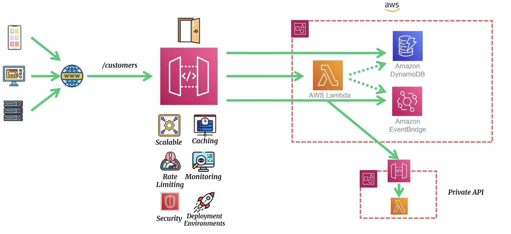

# AWS API Gateway Fundamentals

## 1. Introduction to API Gateway

- Fully managed service for creating, deploying, and managing APIs.
- Supports REST, WebSocket, and HTTP APIs.
- Acts as a "front door" for applications to access backend services securely.

### 1.1 Key Features

- **Multiple API Types**: REST, WebSocket, HTTP.
- **Security**: IAM, Lambda Authorizers, API Keys.
- **Integration Options**: AWS Lambda, HTTP endpoints, VPC links.
- **Cost Efficiency**: Pay-as-you-go pricing model.

---

## 2. Types of APIs

### 2.1 REST APIs

- Best for CRUD applications and traditional web/mobile apps.
- Supports API Gateway features like caching, custom authorizers, and monitoring.
- **Example Use Case**: Backend APIs for web apps.

### 2.2 HTTP APIs

- Lightweight, lower-cost APIs.
- Designed for low-latency use cases.
- Limited feature set compared to REST APIs.
- **Example Use Case**: Proxy to AWS Lambda.



### 2.3 WebSocket APIs

- For real-time, two-way communication.
- Ideal for chat apps, stock tickers, and game leaderboards.
- **Example Use Case**: Real-time communication for mobile apps.

### Comparison

# HTTP, REST, & WebSockets Comparison

| Feature                      | HTTP                             | REST                               | WebSockets                       |
| ---------------------------- | -------------------------------- | ---------------------------------- | -------------------------------- |
| **Throttling**               | Account, Route                   | Account, Route, Stage, Client      | Account, Route, Stage            |
| **Usage Limits**             | ❌                                | Per Client                         | ❌                                |
| **DDoS Protection**          | ❌                                | WAF                                | ❌                                |
| **AWS Service Integrations** | Limited (10)                     | 100+                               | 100+                             |
| **Caching**                  | ❌                                | On Request                         | ❌                                |
| **Validation**               | Request Validation               | Request Validation                 | Request Validation               |
| **Transformers**             | Request Parameter Transformation | Request Parameter Transformation   | Request Parameter Transformation |
| **Authorization**            | IAM, Lambda, JWT                 | IAM, Lambda, Cognito               | Custom                           |
| **Monitoring**               | Access Logs                      | Access Logs, Execution Logs, X-Ray | Access Logs                      |
| **Privacy**                  | VPC Connectivity                 | VPC Connectivity, Private API      | VPC Connectivity                 |

---

## 3. Components of API Gateway

### 3.1 Resources and Methods

- **Resources**: Define endpoints (e.g., `/users`, `/orders`).
- **Methods**: Define HTTP methods (e.g., GET, POST).

### 3.2 Stages

- Represent different versions/environments of the API.(version control)
- Deployment environment where the API can be accessed.
- On creating stage, a publicly accessible GW endpoint gets created
- Examples: `Development`, `Testing`, `Production`.

### 3.3 Deployment

- Deploy APIs to stages for access.
- Versions tracked for better management.

---

## 4. Security in API Gateway

### 4.1 Authentication and Authorization

- **IAM Roles**: Control access to APIs.
- **Lambda Authorizers**: Custom auth logic (e.g., JWT validation).
- **Cognito User Pools**: OAuth2 and OpenID Connect support.

### 4.2 Resource Policies

Restrict access by source IP or VPC endpoints.

**Example Policy:**

```json
{
  "Version": "2012-10-17",
  "Statement": [
    {
      "Effect": "Deny",
      "Principal": "*",
      "Action": "execute-api:Invoke",
      "Resource": "arn:aws:execute-api:us-east-1:123456789012:example-api/*",
      "Condition": {
        "NotIpAddress": {
          "aws:SourceIp": "203.0.113.0/24"
        }
      }
    }
  ]
}
```

### 4.3 Certificates

*Client Certificate*

- Generate client-side SSL certificate using the API gateway
- Allow Backend to verify request coming from API Gateway using public key
- 365 days expiery

*mTLS*

- Browser verified server and server verifies browser
- Client is required to send X.509 cert to verify
- Common for IoT and B2B application communication

### 4.4 Custom domain names

- User friendly names for api endpoint

## 5. API Gateway Integrations

### 5.1 Lambda Proxy Integration

    •    Simplifies connecting APIs to AWS Lambda.
    •    Passes all request data to Lambda functions.

### 5.2 HTTP Proxy Integration

    •    Forward requests directly to backend HTTP endpoints.
    •    Example: API Gateway as a proxy for external APIs.

### 5.3 AWS Service Integration

    •    Invoke AWS services directly.
    •    Example: Put objects in an S3 bucket via API Gateway.

## 6. Caching in API Gateway

### 6.1 Benefits of Caching

    •    Reduces backend load.
    •    Improves response time.
    •    Configurable per stage.

### 6.2 How to Implement

    •    Enable caching for methods.
    •    Configure TTL and cache size.

## 7. Monitoring and Logging

### 7.1 CloudWatch Metrics

    •    Monitor latency, errors, and throttling.
    •    Example Metrics:
    •    4XXError: Count of client errors.
    •    5XXError: Count of server errors.

### 7.2 CloudWatch Logs

    •    Enable detailed logging for debugging.
    •    Example Log Fields:
    •    Request/response payloads.
    •    Latency per request.

## 8. Cost Optimization in API Gateway

[Amazon API Gateway Pricing Page](https://aws.amazon.com/api-gateway/pricing/).

### 8.1 Understanding Pricing

    •    Pay for:
    •    Number of API calls.
    •    Data transfer out.
    •    Caching (if enabled).

### 8.2 Reducing Costs

    •    Use HTTP APIs for lightweight workloads.
    •    Avoid over-provisioning cache.
    •    Minimize unnecessary API calls.

## 9. Common Pitfalls to Avoid

### 9.1 Overly Broad Permissions

    •    Always use the principle of least privilege.
    •    Avoid * in resource policies.

### 9.2 Inefficient Caching

    •    Misconfigured TTL can lead to cache misses.
    •    Monitor cache hit rates regularly.

### 9.3 Misconfigured Integrations

    •    Test integrations thoroughly.
    •    Use AWS X-Ray for tracing.

## Hands-on Labs

API Gateway Path for testing: 

```
<API_BASE_URL>/<STAGE>/<ROUTE>
```

### Lab 1: Create a Basic HTTP API for data retrieval

    1.    Create an API Gateway HTTP API.
    2.    Configure a GET endpoint (/product/{id}).
    3.    Integrate the API with a Lambda function.
        •    The Lambda function fetches product details from a simple JSON object or database.
    4.    Deploy the API.

### Lab 2: Secure an API with IAM and Cognito

    1.    Create an API Gateway REST API with the following routes:
        •    POST /todo - Add a new to-do item.
        •    GET /todo/{id} - Retrieve a to-do item.
        •    PUT /todo/{id} - Update a to-do item.
        •    DELETE /todo/{id} - Delete a to-do item.
    2.    Integrate each route with a Lambda function handling respective operations.
    3.    Store to-do items in a DynamoDB table.
    4.    Enable Cognito User Pool authentication for secure access.
    5.    Deploy the API.

### Lab 3: Real time chat application

    1.    Create an API Gateway WebSocket API with the following routes:
        •    $connect - Establish a WebSocket connection.
        •    $disconnect - Handle disconnections.
        •    sendMessage - Send a chat message.
    2.    Use a DynamoDB table to manage connected client IDs and chat logs.
    3.    Integrate API Gateway routes with Lambda functions:
        •    $connect:
        •    Store the connection ID in DynamoDB.
        •    $disconnect:
        •    Remove the connection ID from DynamoDB.
        •    sendMessage:
        •    Retrieve all connected client IDs from DynamoDB.
        •    Use the API Gateway postToConnection action to forward the message to all clients.
    4.    Deploy the WebSocket API.

## Quiz

Basics
    1.    What is the difference between REST and HTTP APIs in API Gateway?

Security
    2.    How does API Gateway integrate with Cognito User Pools?

Cost
    3.    What factors impact the cost of using API Gateway?
