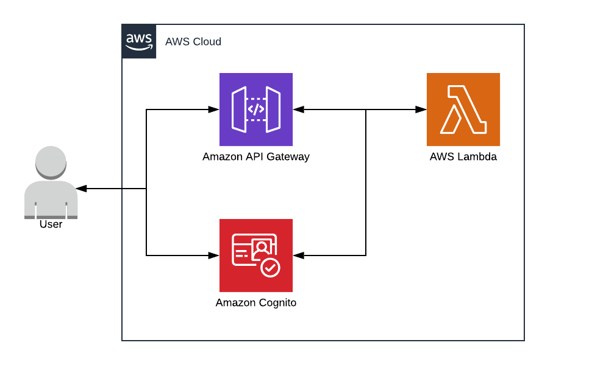
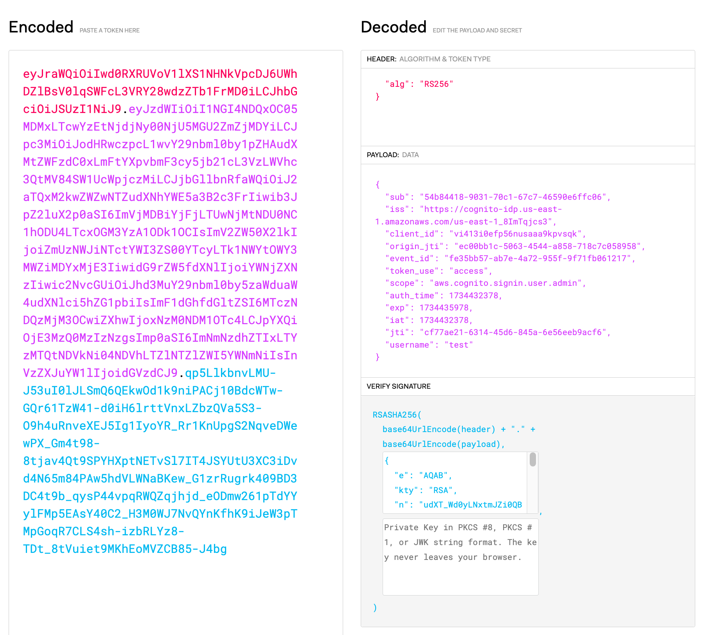

# AWS Cognito Fundamentals

## 1 Overview of AWS Cognito

* AWS Cognito provides user sign-up, sign-in, and access control for web and mobile apps.
* Two main components:
  * **User Pools**: Managed user directory for authentication.
  * **Identity Pools**: Provide temporary AWS credentials for authorized access to AWS services.
* Fully managed service for secure and scalable user management.

---

## 2 User Pools

### Features of User Pools

* **Authentication**:
  * Supports username/password and federated identity providers (Google, Facebook, SAML, OIDC).
* **Authorization**:
  * Define custom roles and scopes using access tokens.
* **Customizable Sign-In Experience**:
  * Add branding, multi-language support, and UI customization.
* **Security Features**:
  * MFA (Multi-Factor Authentication), password policies, and account recovery.
* **Advanced Features**:
  * Triggers with AWS Lambda for custom workflows.

### 2.1 Authentication Flow

User -> Cognito User Pool -> Validate Credentials -> Issue Tokens

### 2.2 Token Types

* **ID Token**: Contains user profile information.
* **Access Token**: Used for securing APIs.
* **Refresh Token**: Used to request new ID and access tokens.

### Quiz: User Pools

1. What are the primary benefits of using a Cognito User Pool?
2. How does Cognito ensure secure authentication?
3. When should you use a Lambda trigger with a User Pool?

---

## 3 Identity Pools

### Features of Identity Pools

* Provides temporary, scoped AWS credentials.
* Supports both authenticated and unauthenticated users.
* Allows access to AWS resources (e.g., S3, DynamoDB).
* Federates identities from multiple providers (Google, Facebook, etc.).

### 3.1 Identity Pool Architecture

User -> Identity Provider -> Identity Pool -> AWS Resources

### 3.2 Federated Identities

* Combine multiple identity sources:
  * Social logins: Google, Facebook, Apple.
  * Corporate logins: SAML, OIDC.
  * Guest users.

### 3.3 Role Mapping

* Map identity pool users to IAM roles.
  * Example:
    * Authenticated users → Role A (Full Access)
    * Unauthenticated users → Role B (Limited Access)

### Quiz: Identity Pools

1. How do Identity Pools differ from User Pools?
2. What is the purpose of federating identities in Cognito?
3. Explain how role mapping ensures proper access control.

---

## 4 Security Features

### 4.1 Multi-Factor Authentication (MFA)

* Adds an extra layer of security.
* Options:
  * SMS-based MFA.
  * TOTP (Time-Based One-Time Password).

### 4.2 Password Policies

* Set rules for:
  * Minimum length, character types.
  * Password expiration and history.

### 4.3 Account Recovery

* Email or SMS for user recovery.
* Supports custom workflows with Lambda triggers.

### Quiz: Security

1. Why is MFA essential for secure user authentication?
2. How can you enforce a strong password policy in AWS Cognito?
3. What triggers can be used for custom account recovery workflows?

---

## 5 Common Architectures

### 5.1 Cognito with Serverless Backend

Client App -> Cognito User Pool -> API Gateway -> Lambda -> DynamoDB

### 5.2 Cognito with Federated Identity

Client App -> Federated Identity (Google) -> Identity Pool -> AWS Resources

---

## 6 Triggers and Customization

### 6.1 AWS Lambda Triggers

* Use Lambda for customizing workflows:
  * Pre-signup: Validate or enrich user data.
  * Post-confirmation: Send welcome emails.
  * Pre-token generation: Add custom claims to tokens.

### 6.2 Hosted UI

* Built-in UI for sign-in/sign-up.
* Supports branding and multi-language.
* Quick setup without building a custom UI.

---

## 7 Best Practices

1. **Security**:
   * Enforce MFA and strong password policies.
   * Use secure IAM roles for Identity Pools.
2. **Scalability**:
   * Leverage Lambda for dynamic workflows.
   * Use federated identities to handle diverse authentication needs.
3. **Cost Management**:
   * Monitor active users and request volumes.
   * Optimize Lambda invocations for triggers.

---

## 8 Hands-on Labs

### Lab 1: Setting Up a User Pool

1. Create a User Pool in AWS Management Console.
2. Configure attributes (email, phone).
3. Set up a test client and verify the authentication flow.

### Lab 2: Setting Up an Identity Pool

1. Create an Identity Pool.
2. Integrate with a User Pool.
3. Configure IAM roles for authenticated and unauthenticated users.

### Lab 3: Customizing Authentication Flow

1. Create a Lambda function for pre-signup validation.
2. Integrate Lambda with the User Pool.
3. Test the workflow with a test client.

# 
