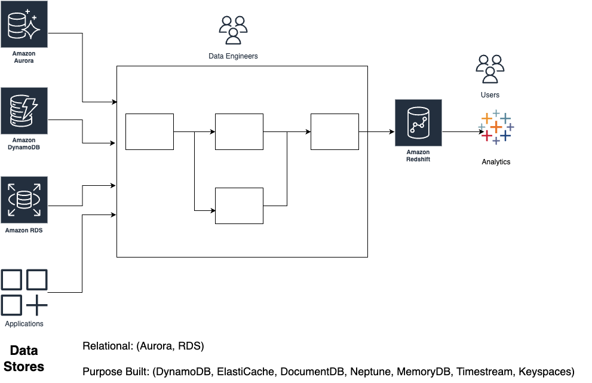
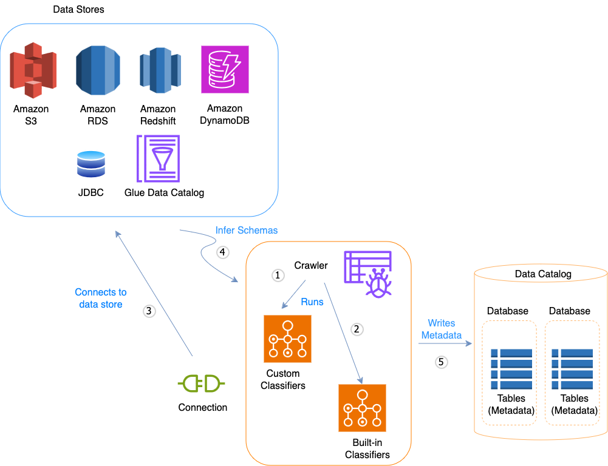
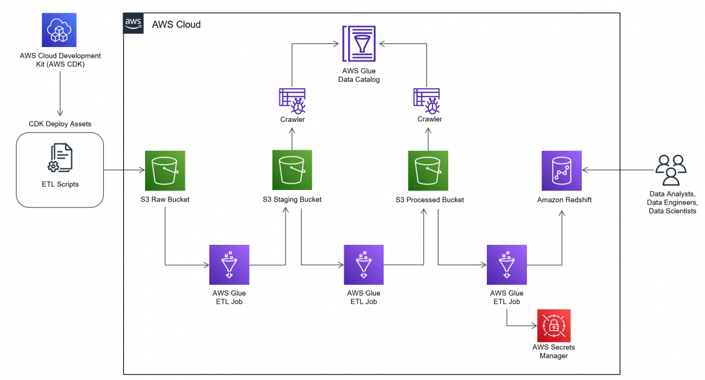
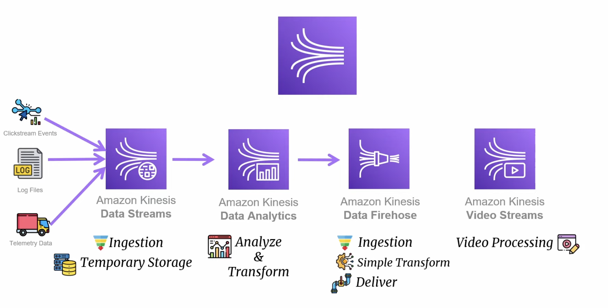

# AWS for ETL Systems

## Introduction

Why do we need?

## 1 Overview of AWS for ETL Systems

AWS provides a suite of tools and services for building robust ETL (Extract, Transform, Load) pipelines. These pipelines handle data ingestion, processing, and loading into storage or analytics systems. Key components include:

- **AWS Glue:** Fully managed ETL service.

- **Amazon S3:** Centralized data lake storage.

- **Amazon Kinesis:** Real-time data ingestion.

- **AWS Lambda:** Serverless compute for transformations.

- **Amazon Redshift:** Fully managed data warehouse with zeroETL capabilities.

## 2 AWS Glue

### Features of AWS Glue

- **Data Catalog:** Central metadata repository.

- **ETL Jobs:** Supports Python and Spark for transformations.

- **Crawlers:** Automatically discover and catalog data.

- **Security:** IAM integration and encryption support.

- **Serverless:** No infrastructure management required.

### 2.1 Glue Architecture

Data Source -> Glue Crawler -> Data Catalog -> Glue ETL Job -> Destination

**Data Discovery, Crawler, Data Catalog**

### 2.2 Glue ETL Jobs

- **Programming Options:**
  
  - Spark (PySpark).
  
  - Python Shell.

- **Workflow:**
  
  - Extract: Read data from various sources (S3, etc.).
  
  - Transform: Apply data transformations.
  
  - Load: Write processed data to destinations like S3 or Redshift.
  
  

## Quiz: AWS Glue

1. What are the core components of AWS Glue?

2. Explain how Glue Crawlers work.

3. How can you secure an ETL job in AWS Glue?

## 3 Amazon Redshift

### Features of Amazon Redshift

- **Data Warehousing:** Fully managed, scalable data warehouse for analytics.

- **ZeroETL Integration:** Seamlessly load data from operational systems like Aurora and S3.

- **Massively Parallel Processing (MPP):** High-performance query execution.

- **Columnar Storage:** Optimized for analytics workloads.

- **Redshift Spectrum:** Query data in S3 without loading.

### 3.1 Redshift Architecture

Data Source -> Redshift Data Loader/Glue -> Redshift Cluster -> Analytics

### 3.2 Redshift ZeroETL Workflows

- Directly integrate with Amazon Aurora for continuous data replication.

- Use Glue to transform and load large datasets into Redshift.

- 12 Zero-ETL Sources
  
  - Amazon databases: Aurora MySQL/PostgresSQL, RDS MySQL/PostgresSQL
  
  - Applications: Saleforce, Zendesk, ServiceNow, SAP, Facebook Ads, Instagram Ads, Salesforce Marketing, Zoho CRM

### 3.3 Use Cases for Redshift

- Real-time analytics dashboards.

- Business intelligence tools integration (e.g., QuickSight, Tableau).

- Advanced reporting and machine learning data preparation.

## Quiz: Amazon Redshift

1. What is the purpose of Redshift Spectrum?

2. How does Redshift's zeroETL capability simplify data integration?

3. Explain how MPP benefits Redshift performance.

## 4 Apache Airflow (Pipeline as a Code)

A workflow management tool. Series of tasks to be executed in specific order. ETL - is called workflow, but in Apache Airflow, it's called DAG.

- Directed - means task moves in one direction

- Acyclic - means there are not loops in the flow, moves in a direction 

- Graph - visual representaiton of all tasks

### Features of Apache Airflow

- **Workflow Orchestration:** Create and manage Directed Acyclic Graphs (DAGs) for complex ETL workflows.

- **Extensibility:** Supports custom plugins and operators (Bash, Python, Email). Executors (Sequential, Local, Celery executors)

- **Integrations:** Seamlessly integrates with AWS services, databases, and third-party tools.

- **Scheduling:** Automate ETL workflows based on time or events.

- **Scalability:** Suitable for small to large-scale workflows.

### 4.1 Airflow Architecture

Data Source -> Airflow DAG -> Operators (e.g., Glue, S3, Redshift) -> Destination

### 4.2 Use Cases for Apache Airflow

- Cross-platform ETL workflows.

- Complex dependencies across multiple pipelines.

- Integration with AWS services via operators (e.g., S3, Redshift).

### 4.3 Airflow Deployment Options

- **Self-Managed:** Deploy on EC2 or Kubernetes.

- **Managed:** Use Amazon Managed Workflows for Apache Airflow (MWAA).

## Quiz: Apache Airflow

1. What are Directed Acyclic Graphs (DAGs) in Airflow?

2. How does Airflow integrate with AWS services?

3. When should you choose Airflow over AWS-native tools like Glue?

## 5 Real-Time Data Processing with AWS

Real-time data processing allows organizations to analyze, process, and act on data as it is generated.

### Features of Amazon Kinesis

- **Data Streams:** **Ingest** high-throughput real-time data.
  
  - clickstream events
  
  - log files
  
  - telemetry data (trust/vehicle braking)

- **Data Firehose:** Automatically deliver data to destinations like S3 or Redshift.
  
  - Ingest
  
  - simple transformation
  
  - Deliver

- **Analytics:** Real-time data insights.
  
  - Analyze and transform data (time window analysis)

### 5.1 Kinesis Architecture

Data Source -> Kinesis Stream -> Processing (Lambda/Analytics) -> Destination

### 5.2 Integration with Machine Learning

- Use AWS SageMaker to make real-time predictions.

- Pipeline example:
  
  - Stream data through Kinesis.
  
  - Transform with Lambda.
  
  - Feed into SageMaker for predictions.

## Quiz: Real-Time Processing

1. What are the differences between Kinesis Streams and Firehose?

2. How can you use Kinesis for real-time machine learning?

3. What are the key benefits of integrating Lambda with Kinesis?

## 6 Batch Processing with AWS

Process large amount of data in groups or batch. 

- Handles data at scheduled interval, data that does not need immediate result

- Used at large scale data transformation, data aggregation, analytics

- Process data at off-peak hours

### Features of AWS Batch

- Orchestrates batch processing jobs.

- Dynamically provisions EC2 and Spot Instances.

- Supports Docker containers.

### 6.1 Batch Architecture

Input Data -> AWS Batch -> Compute Environment -> Processed Data

### 6.2 Integration with Storage

- Use S3 for storing large input and output datasets.

- Optimize cost with S3 lifecycle policies.

## Quiz: Batch Processing

1. What are the advantages of using AWS Batch?

2. How can you optimize costs in AWS Batch pipelines?

3. Explain how S3 integrates with AWS Batch workflows.

## 7 Comparisons and Alternatives

| Feature/Service       | AWS Glue                             | Amazon Redshift                     | Apache Airflow                         | Amazon Kinesis                                             | AWS Batch                                            |
| --------------------- | ------------------------------------ | ----------------------------------- | -------------------------------------- | ---------------------------------------------------------- | ---------------------------------------------------- |
| **Type**              | Fully managed ETL service            | Managed data warehouse with zeroETL | Open-source workflow orchestration     | Real-time data streaming service                           | Batch processing service                             |
| **Use Cases**         | Data transformation, cataloging, ETL | Analytics, data warehousing         | Complex workflows, multi-cloud ETL     | Real-time analytics, streaming pipelines                   | Large-scale batch processing                         |
| **Integration**       | S3, Redshift, DynamoDB               | Glue, S3, BI tools                  | S3, Redshift, Glue, third-party tools  | S3, Lambda, SageMaker                                      | S3, Docker containers                                |
| **Scalability**       | Automatically scales                 | Scales with cluster size            | Customizable with self/managed options | Scales with shard count                                    | Dynamically provisions EC2/Spot Instances            |
| **Ease of Use**       | Minimal setup, serverless            | Requires cluster setup              | Requires setup and DAG configuration   | Minimal setup for Firehose, streams need custom processing | Requires defining job queues and compute environment |
| **Real-Time Support** | Limited                              | No                                  | No                                     | Yes                                                        | No                                                   |
| **Batch Support**     | Yes                                  | No                                  | Yes                                    | No                                                         | Yes                                                  |
| **Pricing Model**     | Pay-per-DPU                          | Pay-per-cluster, Spectrum usage     | Self-managed or MWAA costs             | Pay-per-shard or data ingested                             | Pay-per-instance time                                |
| **Best For**          | Managed ETL with minimal coding      | High-performance analytics          | Complex multi-step workflows           | Streaming and real-time analytics                          | Cost-effective large-scale batch jobs                |

## 8 Hands-On Labs

### Lab 1: Building a Batch ETL Pipeline

1. 

### Lab 2: Real-Time ETL with Kinesis

1. 

### Lab 3: Using Redshift for Analytics

1. 

### Lab 4: Building Workflows with Apache Airflow

1. 

### Lab 5: Integrating Real-Time Predictions

1. 

## Quiz: Hands-On

1. 

## 9 Pricing Considerations

### Glue Pricing

- Free tier: 1M free requests per month.

### Kinesis Pricing

- Free tier: 1MB/sec data ingestion and 2 consumers for 1 year.

### Redshift Pricing

- Reserved instance discounts.

- Spectrum charges based on the amount of data scanned.

## 10 Best Practices

1. **Security:**
   
   - Encrypt data in transit and at rest.
   
   - Use secure IAM policies.

2. **Scalability:**
   
   - Optimize partitioning in Glue jobs.
   
   - Use auto-scaling for Kinesis Streams.
   
   - Scale Redshift clusters as needed.

3. **Cost Management:**
   
   - Use Spot Instances.
   
   - Monitor costs with AWS Budgets.
   
   - Optimize Redshift queries to minimize data scanned.
